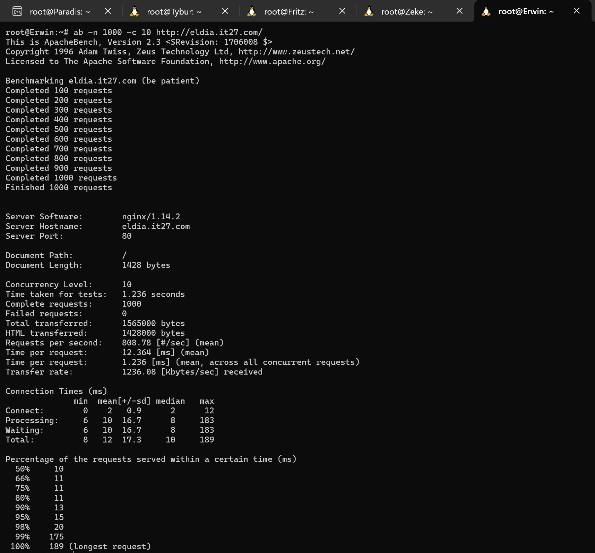

# Jarkom-Modul-3-IT27-2024

## IT 27

| No  | Nama Anggota          | NRP        |
| --- | --------------------- | ---------- |
| 1   | Danendra Fidel Khansa | 5027231063 |
| 2   | Farida Qurrotu A'yuna | 5027231015 |

## Daftar Isi

- [Soal 1](#soal-1)
- [Soal 2](#soal-2)
- [Soal 3](#soal-3)
- [Soal 4](#soal-4)
- [Soal 5](#soal-5)
- [Soal 6](#soal-6)
- [Soal 7](#soal-7)
- [Soal 8](#soal-8)
- [Soal 9](#soal-9)
- [Soal 10](#soal-10)
- [Soal 11](#soal-11)
- [Soal 12](#soal-12)
- [Soal 13](#soal-13)

## Topologi Kelompok IT27 Praktikum Modul 3


## SOAL 0 (Config)

### Paradis (DHCP Relay)

```
auto eth0
iface eth0 inet dhcp

auto eth1
iface eth1 inet static
	address 10.77.1.0
	netmask 255.255.255.0

auto eth2
iface eth2 inet static
	address 10.77.2.0
	netmask 255.255.255.0

auto eth3
iface eth3 inet static
	address 10.77.3.0
	netmask 255.255.255.0

auto eth4
iface eth4 inet static
	address 10.77.4.0
	netmask 255.255.255.0

iptables -t nat -A POSTROUTING -o eth0 -j MASQUERADE -s 10.77.0.0/16
```

### Tybur (DHCP Server)

```
auto eth0
iface  eth0 inet static
  address 10.77.4.2
  netmask 255.255.255.0
  gateway 10.77.4.0

up echo nameserver 192.168.122.1 > /etc/resolv.conf
```

### Fritz (DNS Server)

```
auto eth0
iface  eth0 inet static
  address 10.77.4.1
  netmask 255.255.255.0
  gateway 10.77.4.0

up echo nameserver 192.168.122.1 > /etc/resolv.conf
```

### Warhammer (Database)

```
auto eth0
iface  eth0 inet static
  address 10.77.3.3
  netmask 255.255.255.0
  gateway 10.77.3.0

up echo nameserver 192.168.122.1 > /etc/resolv.conf
```

### Beast ( LoadBalancer Laravel)

```
auto eth0
iface  eth0 inet static
  address 10.77.3.1
  netmask 255.255.255.0
  gateway 10.77.3.0

up echo nameserver 192.168.122.1 > /etc/resolv.conf
```

### Colossal (LoadBalancer PHP)

```
auto eth0
iface  eth0 inet static
  address 10.77.3.2
  netmask 255.255.255.0
  gateway 10.77.3.0

up echo nameserver 192.168.122.1 > /etc/resolv.conf
```

### Annie (Laravel Worker)

```
auto eth0
iface  eth0 inet static
  address 10.77.1.1
  netmask 255.255.255.0
  gateway 10.77.1.0

up echo nameserver 192.168.122.1 > /etc/resolv.conf
```

### Bertholdt (Laravel Worker)

```
auto eth0
iface  eth0 inet static
  address 10.77.1.2
  netmask 255.255.255.0
  gateway 10.77.1.0

up echo nameserver 192.168.122.1 > /etc/resolv.conf
```

### Reiner (Laravel Worker)

```
auto eth0
iface  eth0 inet static
  address 10.77.1.3
  netmask 255.255.255.0
  gateway 10.77.1.0

up echo nameserver 192.168.122.1 > /etc/resolv.conf
```

### Armin (PHP Worker)

```
auto eth0
iface  eth0 inet static
  address 10.77.2.1
  netmask 255.255.255.0
  gateway 10.77.2.0

up echo nameserver 192.168.122.1 > /etc/resolv.conf
```

### Eren (PHP Worker)

```
auto eth0
iface  eth0 inet static
  address 10.77.2.2
  netmask 255.255.255.0
  gateway 10.77.2.0

up echo nameserver 192.168.122.1 > /etc/resolv.conf
```

### Mikasa (PHP Worker)

```
auto eth0
iface  eth0 inet static
  address 10.77.2.3
  netmask 255.255.255.0
  gateway 10.77.2.0

up echo nameserver 192.168.122.1 > /etc/resolv.conf
```

### Zeke (Client)

```
auto eth0
iface  eth0 inet dhcp

up echo nameserver 10.77.4.1 > /etc/resolv.conf
up echo nameserver 192.168.122.1 >> /etc/resolv.conf

```

### Erwin (Client Tetap)

```
auto eth0
iface  eth0 inet dhcp
hwaddress ether 5a:e2:87:8f:a3:40

up echo nameserver 10.77.4.1 > /etc/resolv.conf
up echo nameserver 192.168.122.1 >> /etc/resolv.conf

```

## Bash Install

- Paradis (DHCP Relay)

```sh
apt-get update
apt-get install isc-dhcp-relay -y
```

- Tybur (DHCP Server)

```sh
echo nameserver 192.168.122.1 > /etc/resolv.conf
apt-get update
apt-get install isc-dhcp-server -y
dhcpd --version

echo INTERFACES="eth0" > /etc/default/isc-dhcp-serverm
```

- Fritz (DNS Server)

```sh
echo nameserver 192.168.122.1 > /etc/resolv.conf
apt-get update
apt-get install bind9 -y
```

- Warhammer (Database)

```sh
echo nameserver 192.168.122.1 > /etc/resolv.conf

apt-get update
apt-get install mariadb-server -y
service mysql start
```

- Beast (LoadBalancer Laravel)

- Colossal (LoadBalancer PHP)

```sh
echo nameserver 192.168.122.1 > /etc/resolv.conf

apt-get update
apt-get install apache2-utils php7.3 php-fpm -y
apt-get install nginx -y
apt-get install lynx -y
```

- Annie , Bertholdt, Reiner (Laravel Worker)

- Armin, Eren, Mikasa (PHP Worker)

```sh
echo nameserver 10.77.2.1 >> /etc/resolv.conf

apt-get update
apt-get install nginx -y
apt-get install lynx -y
apt-get install php php-fpm -y
apt-get install wget -y
apt-get install unzip -y
service nginx start
service php7.3-fpm start

wget -O '/var/www/eldia.it27.com' 'https://drive.google.com/uc?export=download&id=1ufulgiWyTbOXQcow11JkXG7safgLq1y-'
unzip -o /var/www/eldia.it27.com -d /var/www/
rm /var/www/eldia.it27.com
mv /var/www/modul-3 /var/www/eldia.it27.com
```

## SOAL 1

Pulau Paradis telah menjadi tempat yang damai selama 1000 tahun, namun kedamaian tersebut tidak bertahan selamanya. Perang antara kaum Marley dan Eldia telah mencapai puncak. Kaum Marley yang dipimpin oleh Zeke, me-register domain name **marley.yyy.com** untuk worker Laravel mengarah pada **Annie**. Namun ternyata tidak hanya kaum Marley saja yang berinisiasi, kaum Eldia ternyata sudah mendaftarkan domain name **eldia.yyy.com** untuk worker PHP (0) mengarah pada **Armin**.

- Buat script pada DNS Server Fritz dengan nama `1.sh`

```sh
echo 'zone "marley.it27.com" {
        type master;
        file "/etc/bind/jarkom/marley.it27.com";
};

zone "eldia.it27.com" {
        type master;
        file "/etc/bind/jarkom/eldia.it27.com";
};' > /etc/bind/named.conf.local

mkdir /etc/bind/jarkom

echo ';
; BIND data file for local loopback interface
;
$TTL    604800
@       IN      SOA     marley.it27.com. root.marley.it27.com. (
                        2024051601      ; Serial
                        604800          ; Refresh
                        86400           ; Retry
                        2419200         ; Expire
                        604800 )        ; Negative Cache TTL
;
@               IN      NS      marley.it27.com.
@               IN      A       10.77.1.1 ; IP Annie Laravel Workerr' > /etc/bind/jarkom/marley.it27.com

echo ';
; BIND data file for local loopback interface
;
$TTL    604800
@       IN      SOA     eldia.it27.com.  eldia.it27.com.  (
                        2024051601      ; Serial
                        604800          ; Refresh
                        86400           ; Retry
                        2419200         ; Expire
                        604800 )        ; Negative Cache TTL
;
@               IN      NS      eldia.it27.com.
@               IN      A       10.77.2.1 ; IP Armin PHP Worker' > /etc/bind/jarkom/eldia.it27.com

echo 'options {
        directory "/var/cache/bind";

        forwarders {
                192.168.122.1;
        };

        // dnssec-validation auto;
        allow-query{any;};
        auth-nxdomain no;    # conform to RFC1035
        listen-on-v6 { any; };
}; ' >/etc/bind/named.conf.options

service bind9 restart

```

- Kemudian `ping marley.it27.com` pada client `Zeke` dan `ping eldia.it27.com` pada client `Erwin`


## SOAL 2

Semua Client harus menggunakan konfigurasi ip address dari keluarga **Tybur (dhcp)**.

**Client** yang melalui bangsa marley mendapatkan range IP dari [prefix IP].1.05 - [prefix IP].1.25 dan [prefix IP].1.50 - [prefix IP].1.100

- Pada Paradis (DHCP Relay) buat script `nano paradis.sh` untuk dairahkan ke Tybur (DHCP Server)

```sh
apt-get update
apt-get install isc-dhcp-relay -y
service isc-dhcp-relay start

relay="SERVERS=\"10.77.4.2\"
INTERFACES=\"eth1 eth2 eth3 eth4\"
OPTIONS=\"\"
"
echo "$relay" > /etc/default/isc-dhcp-relay

echo net.ipv4.ip_forward=1 > /etc/sysctl.conf

service isc-dhcp-relay restart
```

- Setelah di run script diatas dengan `bash paradis.sh` lalu pindah ke Tybur (DHCP Server) dan buat script `nano 2.sh` untuk setup subnet yang marley dahulu

```sh
echo 'subnet 10.77.3.0 netmask 255.255.255.0 {
    option routers 10.77.3.0;
}

subnet 10.77.4.0 netmask 255.255.255.0 {
    option routers 10.77.4.0;
}

subnet 10.77.1.0 netmask 255.255.255.0 {
    range 10.77.1.5 10.77.1.25;
    range 10.77.1.50 10.77.1.100;
    option routers 10.77.1.1;
}' > /etc/dhcp/dhcpd.conf
```

## SOAL 3

**Client** yang melalui bangsa eldia mendapatkan range IP dari [prefix IP].2.09 - [prefix IP].2.27 dan [prefix IP].2 .81 - [prefix IP].2.243.

- Kemudian tambahkan setup subnet yang eldia dengan bikin script baru yaitu `nano 3.sh`

```sh
echo 'subnet 10.77.3.0 netmask 255.255.255.0 {
    option routers 10.77.3.0;
}

subnet 10.77.4.0 netmask 255.255.255.0 {
    option routers 10.77.4.0;
}

subnet 10.77.1.0 netmask 255.255.255.0 {
    range 10.77.1.5 10.77.1.25;
    range 10.77.1.50 10.77.1.100;
    option routers 10.77.1.1;
}

subnet 10.77.2.0 netmask 255.255.255.0 {
    range 10.77.2.09 10.77.2.27;
    range 10.77.2.81 10.77.2.243;
    option routers 10.77.2.1;
} ' > /etc/dhcp/dhcpd.conf
```

## SOAL 4

**Client** mendapatkan DNS dari keluarga Fritz dan dapat terhubung dengan internet melalui DNS tersebut.

- Kemudian buat script baru lagi dengan `nano 4.sh` untuk nambahin `option-domain-name-servers`

```sh
echo 'subnet 10.77.3.0 netmask 255.255.255.0 {
    option routers 10.77.3.0;
    option broadcast-address 10.77.3.255;
}

subnet 10.77.4.0 netmask 255.255.255.0 {
    option routers 10.77.4.0;
    option broadcast-address 10.77.4.255;
}

subnet 10.77.1.0 netmask 255.255.255.0 {
    range 10.77.1.5 10.77.1.25;
    range 10.77.1.50 10.77.1.100;
    option routers 10.77.1.1;
    option broadcast-address 10.77.1.255;
    option domain-name-servers 10.77.4.1;
}

subnet 10.77.2.0 netmask 255.255.255.0 {
    range 10.77.2.9 10.77.2.27;
    range 10.77.2.81 10.77.2.243;
    option routers 10.77.2.1;
    option broadcast-address 10.77.2.255;
    option domain-name-servers 10.77.4.1;
} ' > /etc/dhcp/dhcpd.conf
```

- Jangan lupa untuk setup di Fritz (DNS Server) pake `nano fritz.sh`

```sh
echo 'options {
        directory "/var/cache/bind";

        forwarders {
                192.168.122.1;
        };

        // dnssec-validation auto;
        allow-query{any;};
        auth-nxdomain no;    # conform to RFC1035
        listen-on-v6 { any; };
}; ' >/etc/bind/named.conf.options
```

## SOAL 5

Dikarenakan keluarga **Tybur** tidak menyukai kaum **eldia**, maka mereka hanya meminjamkan ip address ke kaum **eldia** selama 6 menit. Namun untuk kaum **marley**, keluarga **Tybur** meminjamkan ip address selama 30 menit. Waktu maksimal dialokasikan untuk peminjaman alamat IP selama 87 menit.

- Untuk nambahin limit waktu buat script baru lagi yaitu `nano 5.sh` seperti berikut, tambahkan authoritative; di awal konfigurasi agar DHCP server menjadi sumber otoritatif untuk jaringan tersebut.

```sh

echo INTERFACESv4="eth0" > /etc/default/isc-dhcp-server

echo 'authoritative;

subnet 10.77.3.0 netmask 255.255.255.0 {
    option routers 10.77.3.0;
    option broadcast-address 10.77.3.255;
}

subnet 10.77.4.0 netmask 255.255.255.0 {
    option routers 10.77.4.0;
    option broadcast-address 10.77.4.255;
}

subnet 10.77.1.0 netmask 255.255.255.0 {
    range 10.77.1.5 10.77.1.25;
    range 10.77.1.50 10.77.1.100;
    option routers 10.77.1.1;
    option broadcast-address 10.77.1.255;
    option domain-name-servers 10.77.4.1;
    default-lease-time 1800;
    max-lease-time 5220;
}

subnet 10.77.2.0 netmask 255.255.255.0 {
    range 10.77.2.9 10.77.2.27;
    range 10.77.2.81 10.77.2.243;
    option routers 10.77.2.1;
    option broadcast-address 10.77.2.255;
    option domain-name-servers 10.77.4.1;
    default-lease-time 360;
    max-lease-time 5220;
} ' > /etc/dhcp/dhcpd.conf

service isc-dhcp-server restart
```

- Lakukan `bash 5.sh` untuk menjalankan Tybur (DHCP Server)

- Kemudian coba tes telnet ke client `zeke` untuk marley dan `erwin` untuk eldia, namun sebelum itu tolong matikan dulu kedua client lalu nyalakan kembali dan hasilnya berikut, coba ping

- Client `Zeke` (ditandai dengan udhcpc saat masuk)


- Client `Erwin` (ditandai dengan udhcpc saat masuk)


## SOAL 6

**Armin** berinisiasi untuk memerintahkan setiap worker PHP untuk melakukan konfigurasi virtual host untuk website berikut https://intip.in/BangsaEldia dengan menggunakan php 7.3

- Buat script `nano 6.sh` untuk menginstall PHP pada `worker PHP Armin` lalu lakukan `bash 6.sh`

```sh
#!/bin/bash

# Tambahkan nameserver
echo nameserver 10.77.2.1 >> /etc/resolv.conf
apt-get update
apt-get install nginx -y
apt-get install lynx -y
apt-get install php php-fpm -y
apt-get install wget -y
apt-get install unzip -y
service nginx start
service php7.3-fpm start

wget -O '/var/www/eldia.it27.com' 'https://drive.google.com/uc?export=download&id=1ufulgiWyTbOXQcow11JkXG7safgLq1y-'
unzip -o /var/www/eldia.it27.com -d /var/www/
rm /var/www/eldia.it27.com
mv /var/www/modul-3 /var/www/eldia.it27.com

cp /etc/nginx/sites-available/default /etc/nginx/sites-available/eldia.it27.com
ln -s /etc/nginx/sites-available/eldia.it27.com /etc/nginx/sites-enabled/
rm /etc/nginx/sites-enabled/default

echo 'server {
     listen 80;
     server_name _;

     root /var/www/eldia.it27.com;
     index index.php index.html index.htm;

     location / {
         try_files $uri $uri/ /index.php?$query_string;
     }

     location ~ \.php$ {
         include snippets/fastcgi-php.conf;
         fastcgi_pass unix:/run/php/php7.3-fpm.sock;
         fastcgi_param SCRIPT_FILENAME $document_root$fastcgi_script_name;
         include fastcgi_params;
     }
 }' > /etc/nginx/sites-available/eldia.it27.com

 service nginx restart
```

- Kemudian untuk mengetesnya pindah ke client bebas (Zeke/Erwin) dan install dahulu `apt install lynx` pada client, kemudian test dengan `lynx http://eldia.it27.com` untuk di worker cukup `lynx localhost`berikut hasilnya

- Pada Worker


- Pada Client Zeke


- Pada Client Erwin


## SOAL 7

Dikarenakan Armin sudah mendapatkan kekuatan titan colossal, maka bantulah kaum **eldia** menggunakan **colossal** agar dapat bekerja sama dengan baik. Kemudian lakukan testing dengan 6000 request dan 200 request/second.

- Pertama ke Paradis (DHCP Relay) untuk mengatur agar diarahkan ke Colossal (LoadBalancer) dan buat script `nano 7lb.sh` kemudian jalankan `bash 7lb.sh`

```sh
echo 'zone "marley.it27.com" {
        type master;
        file "/etc/bind/jarkom/marley.it27.com";
};

zone "eldia.it27.com" {
        type master;
        file "/etc/bind/jarkom/eldia.it27.com";
};' > /etc/bind/named.conf.local

mkdir /etc/bind/jarkom

echo ';
; BIND data file for local loopback interface
;
$TTL    604800
@       IN      SOA     marley.it27.com. root.marley.it27.com. (
                        2024051601      ; Serial
                        604800          ; Refresh
                        86400           ; Retry
                        2419200         ; Expire
                        604800 )        ; Negative Cache TTL
;
@               IN      NS      marley.it27.com.
@               IN      A       10.77.3.2 ; IP Colossal' > /etc/bind/jarkom/marley.it27.com

echo ';
; BIND data file for local loopback interface
;
$TTL    604800
@       IN      SOA     eldia.it27.com.  eldia.it27.com.  (
                        2024051601      ; Serial
                        604800          ; Refresh
                        86400           ; Retry
                        2419200         ; Expire
                        604800 )        ; Negative Cache TTL
;
@               IN      NS      eldia.it03.com.
@               IN      A       10.77.3.2 ; IP Colossal' > /etc/bind/jarkom/eldia.it27.com

echo 'options {
        directory "/var/cache/bind";

        forwarders {
                192.168.122.1;
        };

        // dnssec-validation auto;
        allow-query{any;};
        auth-nxdomain no;    # conform to RFC1035
        listen-on-v6 { any; };
}; ' >/etc/bind/named.conf.options

service bind9 restart
```

- Setelah itu pindah ke Colossal (LoadBalancer) dan buat script `nano 7.sh` kemudian jalankan `bash 7.sh`

```sh
cp /etc/nginx/sites-available/default /etc/nginx/sites-available/lb_php

echo '
upstream worker {
    server 10.77.2.1;
    server 10.77.2.2;
    server 10.77.2.3;
}

server {
    listen 80;
    server_name eldia.it27.com www.eldia.it27.com;

    root /var/www/html;

    index index.html index.htm index.nginx-debian.html;

    location / {
        proxy_pass http://worker;
        proxy_set_header Host $host;
        proxy_set_header X-Real-IP $remote_addr;
        proxy_set_header X-Forwarded-For $proxy_add_x_forwarded_for;
        proxy_set_header X-Forwarded-Proto $scheme;
    }
}
' > /etc/nginx/sites-available/lb_php

ln -sf /etc/nginx/sites-available/lb_php /etc/nginx/sites-enabled/

if [ -f /etc/nginx/sites-enabled/default ]; then
    rm /etc/nginx/sites-enabled/default
fi

service nginx restart
```

- Setelah itu untuk melakukan pengetesan pada client (Erwin) install terlebih dahulu berikut dan buat scriptnya `nano 7test.sh` lalu `bash 7test.sh`

```sh
apt update
apt install lynx -y
apt install htop -y
apt install apache2-utils -y
apt-get install jq -y
```

- Kemudian pada client (Erwin) `ab -n 6000 -c 200 http://eldia.it27.com/`


## SOAL 8

Karena Erwin meminta “laporan kerja Armin”, maka dari itu buatlah analisis hasil testing dengan 1000 request dan 75 request/second untuk masing-masing algoritma Load Balancer dengan ketentuan sebagai berikut:

1. Nama Algoritma Load Balancer
2. Report hasil testing pada Apache Benchmark
3. Grafik request per second untuk masing masing algoritma.
4. Analisis

- Lakukan setup pada `Colossal` (Load Balancer PHP)

- Round-robin

```
upstream worker {
    server 10.77.2.1;
    server 10.77.2.2;
    server 10.77.2.3;
}
```

- Generic Hash

```
upstream worker {
    hash $request_uri consistent;
    server 10.77.2.1;
    server 10.77.2.2;
    server 10.77.2.3;
}
```

- Least Connection

```
upstream worker {
    least_conn;
    server 10.77.2.1;
    server 10.77.2.2;
    server 10.77.2.3;
}
```

- IP Hash

```
upstream worker {
    ip_hash;
    server 10.77.2.1;
    server 10.77.2.2;
    server 10.77.2.3;
}
```

- Diatas merupakan algoritma yang akan kita gunakan selanjutnya buat script pada Colossal (LoadBalancer) `nano 8.sh` kemudian `bash 8.sh`

```sh
cp /etc/nginx/sites-available/default /etc/nginx/sites-available/lb_php

echo '
upstream worker {
    # hash $request_uri consistent;
    # least_conn;
    # ip_hash;
    server 10.77.2.1;
    server 10.77.2.2;
    server 10.77.2.3;
}

server {
    listen 80;
    server_name eldia.it27.com www.eldia.it27.com;

    root /var/www/html;
    index index.html index.htm index.nginx-debian.html;

    location / {
        proxy_pass http://worker;
        proxy_set_header Host $host;
        proxy_set_header X-Real-IP $remote_addr;
        proxy_set_header X-Forwarded-For $proxy_add_x_forwarded_for;
        proxy_set_header X-Forwarded-Proto $scheme;
    }
}
' > /etc/nginx/sites-available/lb_php

ln -sf /etc/nginx/sites-available/lb_php /etc/nginx/sites-enabled/

if [ -f /etc/nginx/sites-enabled/default ]; then
    rm /etc/nginx/sites-enabled/default
fi

service nginx restart
```

Jika ingin menggunakan algoritma round-robin un-comment bagian bawah upstream worker. Sedangkan jika ingin menggunakan algortima lainnya bisa disesuaikan. Jadi `bash 8.sh` satu persatu lalu coba di client

- Jalankan command berikut untuk dianalisis `ab -n 1000 -c 75 http://eldia.it27.com/` dan `htop

- Round-robin


- Generic hash


- Least connection


- IP hash


- Grafik Perbandingan Algoritma


Untuk Laporan akan di drop di pdf

## SOAL 9

Dengan menggunakan algoritma Least-Connection, lakukan testing dengan menggunakan 3 worker, 2 worker, dan 1 worker sebanyak 1000 request dengan 10 request/second, kemudian tambahkan grafiknya pada “laporan kerja Armin”.

- Lakukan setup pada `Colossal` (Load Balancer PHP)

- 3 Worker

```
upstream worker {
    least_conn;
    server 10.77.2.1;
    server 10.77.2.2;
    server 10.77.2.3;
}
```

- 2 Worker

```
upstream worker {
    least_conn;
    server 10.77.2.2;
    server 10.77.2.3;
}
```

- 1 Worker

```
upstream worker {
    least_conn;
    server 10.77.2.3;
}
```

- Buat script baru `nano 9.sh` lalu jalankan `bash 9.sh`

```sh
cp /etc/nginx/sites-available/default /etc/nginx/sites-available/lb_php

echo '
upstream worker {
    least_conn;
    server 10.77.2.1;
    server 10.77.2.2;
    server 10.77.2.3;
}

server {
    listen 80;
    server_name eldia.it27.com www.eldia.it27.com;

    root /var/www/html;
    index index.html index.htm index.nginx-debian.html;

    location / {
        proxy_pass http://worker;
        proxy_set_header Host $host;
        proxy_set_header X-Real-IP $remote_addr;
        proxy_set_header X-Forwarded-For $proxy_add_x_forwarded_for;
        proxy_set_header X-Forwarded-Proto $scheme;
    }
}
' > /etc/nginx/sites-available/lb_php

ln -sf /etc/nginx/sites-available/lb_php /etc/nginx/sites-enabled/

if [ -f /etc/nginx/sites-enabled/default ]; then
    rm /etc/nginx/sites-enabled/default
fi

service nginx restart
```

Lalu un-comment sesuai dengan jumlah worker yang ingin digunakan untuk pengetesan memakai `ab -n 1000 -c 10 http://eldia.it27.com/`

- 3 Worker Test




- 2 Worker Test


- 1 Worker Test


- Grafik Perbandingan Worker


Laporan akan diletakkan di PDF juga

## SOAL 10

Selanjutnya coba tambahkan keamanan dengan konfigurasi autentikasi di **Colossal** dengan dengan kombinasi username: “arminannie” dan password: “jrkmyyy”, dengan yyy merupakan kode kelompok. Terakhir simpan file “htpasswd” nya di /etc/nginx/supersecret/

- Lakukan setup pada `Colossal` (Load Balancer PHP)

- User dan Passnya

```
Username: arminannie
Password: jrkmit27
```

- Buat script `nano 10.sh` lalu run `bash 10.sh`

```sh
mkdir -p /etc/nginx/supersecret

htpasswd -c -b /etc/nginx/supersecret/.htpasswd arminannie jrkmit27

cp /etc/nginx/sites-available/default /etc/nginx/sites-available/lb_php

echo '
upstream worker {
    least_conn;
    server 10.77.2.1;
    server 10.77.2.2;
    server 10.77.2.3;
}

server {
    listen 80;
    server_name eldia.it27.com www.eldia.it27.com;

    root /var/www/html;
    index index.html index.htm index.nginx-debian.html;

    location / {
        proxy_pass http://worker;
        proxy_set_header Host $host;
        proxy_set_header X-Real-IP $remote_addr;
        proxy_set_header X-Forwarded-For $proxy_add_x_forwarded_for;
        proxy_set_header X-Forwarded-Proto $scheme;

        # Basic authentication configuration
        auth_basic "Restricted Content";
        auth_basic_user_file /etc/nginx/supersecret/.htpasswd;
    }
}
' > /etc/nginx/sites-available/lb_php

ln -sf /etc/nginx/sites-available/lb_php /etc/nginx/sites-enabled/

if [ -f /etc/nginx/sites-enabled/default ]; then
    rm /etc/nginx/sites-enabled/default
fi

service nginx restart
```

- Kemudian `lynx http://eldia.it27.com` pada klien atau worker masukkan user dan password sesuai diatas


## SOAL 11

Lalu buat untuk setiap request yang mengandung /titan akan di proxy passing menuju halaman https://attackontitan.fandom.com/wiki/Attack_on_Titan_Wiki

**hint: (proxy_pass)**

- Buat script `nano 11.sh` lalu letakkan di Colossal (LoadBalancer PHP) lalu run `bash 11.sh`

```sh
echo '
upstream worker {
    server 10.77.2.1;
    server 10.77.2.2;
    server 10.77.2.3;
}

server {
    listen 80;
    server_name eldia.it27.com www.eldia.it27.com;

    root /var/www/html;
    index index.html index.htm index.nginx-debian.html;

    location / {
        proxy_pass http://worker;

        # Uncomment these lines to enable basic authentication
        #auth_basic "Restricted Content";
        #auth_basic_user_file /etc/nginx/supersecret/.htpasswd;
    }

    location /titan {
        proxy_pass https://attackontitan.fandom.com/wiki/Titan;
        proxy_set_header Host attackontitan.fandom.com;
        proxy_set_header X-Real-IP $remote_addr;
        proxy_set_header X-Forwarded-For $proxy_add_x_forwarded_for;
        proxy_set_header X-Forwarded-Proto $scheme;
    }
}
' > /etc/nginx/sites-available/lb_php

ln -sf /etc/nginx/sites-available/lb_php /etc/nginx/sites-enabled/

if [ -f /etc/nginx/sites-enabled/default ]; then
    rm /etc/nginx/sites-enabled/default
fi

service nginx restart
```

- Lakukan pengecekan pada klien dengan `lynx http://eldia.it27.com/titan`


## SOAL 12

Selanjutnya **Colossal** ini hanya boleh diakses oleh client dengan IP [Prefix IP].1.77, [Prefix IP].1.88, [Prefix IP].2.144, dan [Prefix IP].2.156.

**hint: (fixed in dulu clientnya)**

- Untuk client tetap disini kita pake `Erwin`

- Masih di Colossal (LoadBalancer PHP) buat script `nano 12.sh` lalu jalankan seperti biasa `bash 12.sh`

```sh
echo '
upstream worker {
    server 10.77.2.1;
    server 10.77.2.2;
    server 10.77.2.3;
}

server {
    listen 80;
    server_name eldia.it27.com www.eldia.it27.com;

    root /var/www/html;
    index index.html index.htm index.nginx-debian.html;

    location / {
        allow 10.77.1.77;
        allow 10.77.1.88;
        allow 10.77.2.144;
        allow 10.77.2.156;
        deny all;

        proxy_pass http://worker;

        # Uncomment these lines to enable basic authentication
        #auth_basic "Restricted Content";
        #auth_basic_user_file /etc/nginx/supersecret/.htpasswd;
    }

    location /titan {
        proxy_pass https://attackontitan.fandom.com/wiki/Titan;
        proxy_set_header Host attackontitan.fandom.com;
        proxy_set_header X-Real-IP $remote_addr;
        proxy_set_header X-Forwarded-For $proxy_add_x_forwarded_for;
        proxy_set_header X-Forwarded-Proto $scheme;
    }
}
' > /etc/nginx/sites-available/lb_php

ln -sf /etc/nginx/sites-available/lb_php /etc/nginx/sites-enabled/

if [ -f /etc/nginx/sites-enabled/default ]; then
    rm /etc/nginx/sites-enabled/default
fi

service nginx restart
```

- Setelah dicoba `lynx http://eldia.it27.com/` di `Erwin` sebagai klien tetap seperti berikut


- Untuk bisa `lynx http://eldia.it27.com/` di Erwin dan mengeblock akses `lynx` yang lain kita perlua menambahkan kembali ke script `nano 12.sh` diatas

- Pertama kita cek untuk klien `Erwin` dengan `ip a` dan ditemukan informasi berikut


- Tambahkan `hwaddress ether 5a:e2:87:8f:a3:40` ke node `Erwin` dan ip `10.77.2.9` kedalam script `nano 12.sh` dengan memasukkan

```
allow 10.77.2.9;
```

Tambahkan di antara `allow` yang lain

- Setelah ditambahkan `bash 12.sh` kembali dan tes di klien `Erwin` dan klien 1nya, seperti berikut

- Pada `Erwin` (Klien Tetap)


- Pada `Zeke` (Bukan Klien Tetap)


## SOAL 13

Karena mengetahui bahwa ada keturunan marley yang mewarisi kekuatan titan, Zeke pun berinisiatif untuk menyimpan data data penting di **Warhammer**, dan semua data tersebut harus dapat diakses oleh anak buah kesayangannya, **Annie**, **Reiner**, dan **Berthold**.

- Pertama buat script `nano 13.sh` pada `Warhammer` sebagai database server dan jalankan `bash 13.sh`

```sh
mysql -e "CREATE USER 'kelompokit27'@'%' IDENTIFIED BY 'passwordit27';"
mysql -e "CREATE USER 'kelompokit27'@'marley.it27.com' IDENTIFIED BY 'passwordit27';"
mysql -e "CREATE DATABASE dbkelompokit27;"
mysql -e "GRANT ALL PRIVILEGES ON *.* TO 'kelompokit27'@'%';"
mysql -e "GRANT ALL PRIVILEGES ON *.* TO 'kelompokit27'@'marley.it27.com';"
mysql -e "FLUSH PRIVILEGES;"

mysql="[mysqld]
skip-networking=0
skip-bind-address
"
echo "$mysql" > /etc/mysql/my.cnf

service mysql restart
```

- Kemudian untuk mengecek database tertaut pada `Annie,
Bertholdt, Reiner` sebagai 3 worker laravel kita perlu install script berikut dengan `nano laravel_lb.sh` pada ke-3 worker laravel tersebut kemudian `bash laravel_lb.sh`

```sh
echo nameserver 192.168.122.1 > /etc/resolv.conf

apt-get update
apt-get install mariadb-client -y
service mysql start
```

- Setelah diinstall kemudian test pada `worker laravel` dengan `mariadb --host=10.77.3.3 --port=3306 --user=kelompokit27 --password=passwordit27`

- Annie Testing


- Bertholdt Testing


- Reiner Testing


